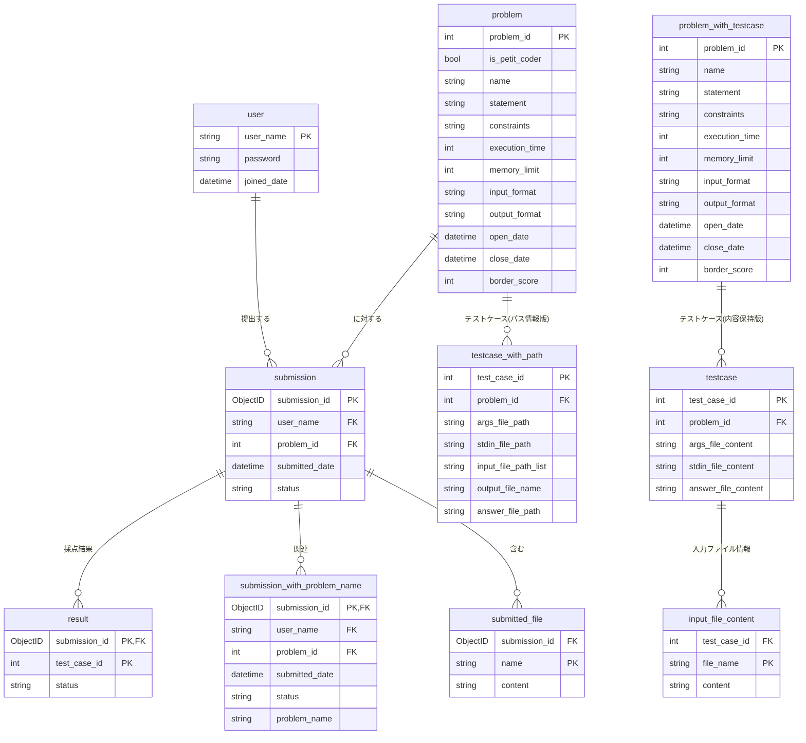

```mermaid
erDiagram
    %% ユーザー（users パッケージ）
    user {
        string user_name PK
        string password
        datetime joined_date
    }

    %% 問題（problems パッケージ：基本版）
    problem {
        int problem_id PK
        bool is_petit_coder
        string name
        string statement
        string constraints
        int execution_time
        int memory_limit
        string input_format
        string output_format
        datetime open_date
        datetime close_date
        int border_score
    }

    %% テストケース（パス情報版：testcase_with_path）
    testcase_with_path {
        int test_case_id PK
        int problem_id FK
        string args_file_path
        string stdin_file_path
        string input_file_path_list
        string output_file_name
        string answer_file_path
    }

    %% 問題（problems パッケージ：内容保持版 problem_with_testcase）
    problem_with_testcase {
        int problem_id PK
        string name
        string statement
        string constraints
        int execution_time
        int memory_limit
        string input_format
        string output_format
        datetime open_date
        datetime close_date
        int border_score
    }

    %% テストケース（内容保持版：testcase）
    testcase {
        int test_case_id PK
        int problem_id FK
        string args_file_content
        string stdin_file_content
        string answer_file_content
    }

    %% 入力ファイルの内容（testcase に含まれる）
    input_file_content {
        int test_case_id FK
        string file_name PK
        string content
    }

    %% 提出（submission パッケージ）
    submission {
        ObjectID submission_id PK
        string user_name FK
        int problem_id FK
        datetime submitted_date
        string status
    }

    %% 各テストケースに対する結果（submission に埋め込まれる）
    result {
        ObjectID submission_id PK, FK
        int test_case_id PK
        string status
    }

    %% 提出ファイル（補助的な submitted_file）
    submitted_file {
        ObjectID submission_id FK
        string name PK
        string content
    }

    %% 提出＋問題名（submission_with_problem_name：submission を拡張）
    submission_with_problem_name {
        ObjectID submission_id PK, FK
        string user_name FK
        int problem_id FK
        datetime submitted_date
        string status
        string problem_name
    }

    %% リレーションシップ
    user ||--o{ submission : "提出する"
    problem ||--o{ submission : "に対する"
    problem ||--o{ testcase_with_path : "テストケース(パス情報版)"
    problem_with_testcase ||--o{ testcase : "テストケース(内容保持版)"
    testcase ||--o{ input_file_content : "入力ファイル情報"
    submission ||--o{ result : "採点結果"
    submission ||--o{ submission_with_problem_name : "関連"
    submission ||--o{ submitted_file : "含む"
```
